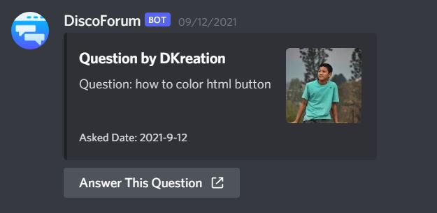
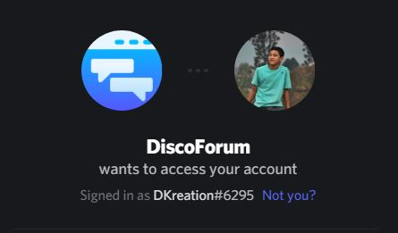
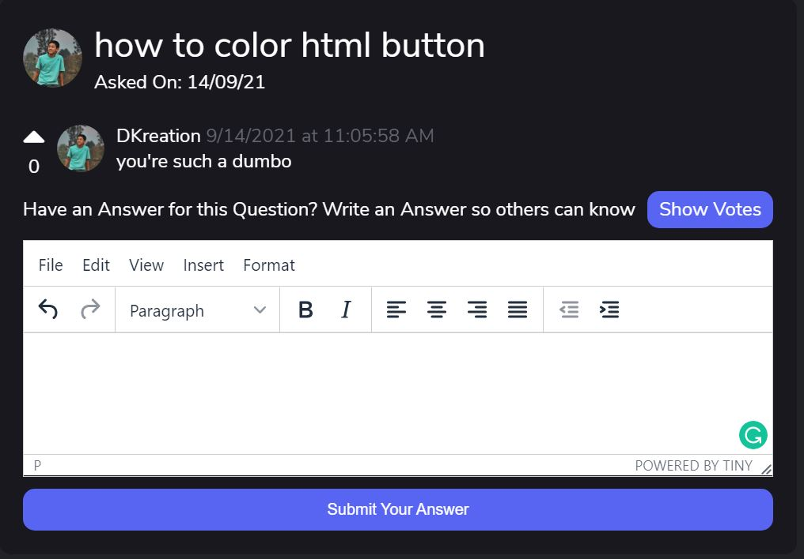

# DiscoForum

DiscoForum is a discord bot that allows you to ask and get questions answered through he means of discord

### Context

DiscoForum was created before discord forums were introduced. This bot allows users to create discussion topics on discord and discuss on them on a different web platform.

## How to run

- Step 1: Run the following commands

```
pip install -m requirements.txt
```

- Step 2: Create a copy of the .env.example file and name it .env
- Step 3: Get credentials for the app from the discord developers menu
- Step 4: Paste the credentails in the .env file that you just created
- Step 5: Run the following command(s)

```
python server.py
python bot.py
python socket_python_server.py
```

The server.py manages all the operations for the server and the bot.py contains the code required to run the bot

## How to Use

```
.ask how to color html button
```



### Login using Discord



### Answer Other's Questions



### Search For Questions


